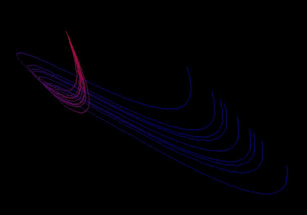



## A flying snake

### Description

The code displays a snake flying across the screen using sin() and cos().
 
### More Info
 
Some basics about sin() and cos()

             |
---                |---
**Submitted On**   |2001-05-30 13:41:46
**By**             |[Thomas Raben](https://github.com/Planet-Source-Code/PSCIndex/blob/master/ByAuthor/thomas-raben.md)
**Level**          |Intermediate
**User Rating**    |4.6 (41 globes from 9 users)
**Compatibility**  |VB 4\.0 \(32\-bit\), VB 5\.0, VB 6\.0
**Category**       |[Graphics](https://github.com/Planet-Source-Code/PSCIndex/blob/master/ByCategory/graphics__1-46.md)
**World**          |[Visual Basic](https://github.com/Planet-Source-Code/PSCIndex/blob/master/ByWorld/visual-basic.md)
**Archive File**   |[A flying s202635302001\.zip](https://github.com/Planet-Source-Code/thomas-raben-a-flying-snake__1-23583/archive/master.zip)

